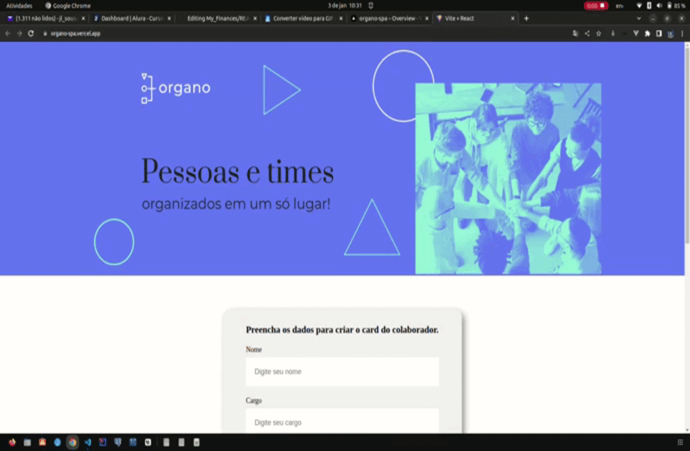

<h1>
  
</h1>

# Índice

- [Sobre](#-sobre)
- [Tecnologias Utilizadas](#-tecnologias-utilizadas)
- [Como baixar o projeto](#-como-baixar-o-projeto)

## 📝Sobre

O projeto **Organo** é um Website para organiza times de Tecnologia desenvolvido pela Alura no curso **React: migrando para Typescript** com intuito de práticar a base do desenvolvimento React.

---

## 🚀Tecnologias utilizadas

O projeto foi desenvolvido utilizando as seguintes tecnologias

- React
- CSS-Modules
- Typescript
- Vite

---

## 📦Como baixar o projeto

```bash
# Clonar o repositório
$ git clone https://github.com/JL-Sousa/organo-spa.git

# Entrar no diretório
$ cd organo

# Baixar as Dependencias
$ yarn ou npm install

# Iniciar o projeto
para rodar o projeto
$ yarn dev ou npm run dev
```

---

🔥Desenvolvido por \***\*_Jonyelson Lopes_\*\***
